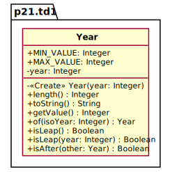

PROJET *RING*
===
Rétro-Ingéniérie d'Objets Java
---

L'objectif du projet est de générer automatiquement le source PlantUML de diagrammes de classes UML 
pour un ou plusieurs types Java.  
Le programme demandé est une commande à laquelle on fournit en argument le nom d'une classe  
et qui produit en sortie un fichier .puml qui contient le source du diagramme de classe 
de cette classe.

On ne traite pas :
- les types imbriquées
- les classes génériques

**S1: L'API *Java Reflection***   
Les informations concernant les types Java et ses membres sont données par l'API Java Reflection.

- [The Java™ Tutorials - Trail: The Reflection API](https://docs.oracle.com/javase/tutorial/reflect/)

Se familiariser avec l'API *Java Reflection* et faire le diagramme de classe
de la hiérarchie des classes de cette API en faisant figurer uniquement les classes
et les opérations qui vous semblent utiles pour la réalisation du projet.

**S2: Une première maquette**  
Dans cette étape, une première maquette de la commande est écrite.
A ce stade, le diagramme PlantUML généré ne fait apparaître que les noms des membres 
(sans les types ni les paramètres pour les opérations).  
Pour une classe Java dont le nom est passé en argument de la ligne de commande,
faire la génération du source PlantUML dans un fichier de même nom que la classe.

Sur le modèle de l'API Reflection, construire une hiérarchie de classes
qui modélise les concepts UML-PlantUML nécessaires. Élaborer les DCA et DCC correspondants.  

**S3: Visibilité, paramètres, résultats, types des membres**  
Rajouter le traitement de la visibilité, des paramètres et du résultat des opérations 
ainsi que les types des membres et des paramètres avec prise en compte des types primitifs UML.
Voir [Obtaining Names of Method Parameters](https://docs.oracle.com/javase/tutorial/reflect/member/methodparameterreflection.html)
en particulier [MethodParameterSpy.java](https://docs.oracle.com/javase/tutorial/displayCode.html?code=https://docs.oracle.com/javase/tutorial/reflect/member/example/MethodParameterSpy.java)

**S4: Autres classificateurs**  
Rajouter le traitement des interfaces, des énumérations et des classes abstraites. 
En UML ces types sont des classificateurs (classifiers).
Traiter aussi les modificateurs (`abstract`, `static`, `final`) pour les membres de ces types.  

**S5: Types composites, multiplicités**  
Remplacer les types composites (tableaux, collections) par des indications de multiplicités 
pour le typage des attributs et des paramètres ou du résultat des opérations. 
On pourra indiquer `{isOrdered}` pour les listes `{isUnique}` pour les ensembles.

**S6: Associations, généralisation, réalisation**   
Cette étape focalise sur la modélisation des relations entre classe.  
Les variables d'instance qui ne sont pas des types primitifs doivent être traduits par une association.
La superclasse est modélisée par un lien de généralisation. 
Les interfaces implémentées sont modélisées par un lien de réalisation;  

*Extensions éventuelles* : diagrammes avec plusieurs classes ; traitement des classes génériques.